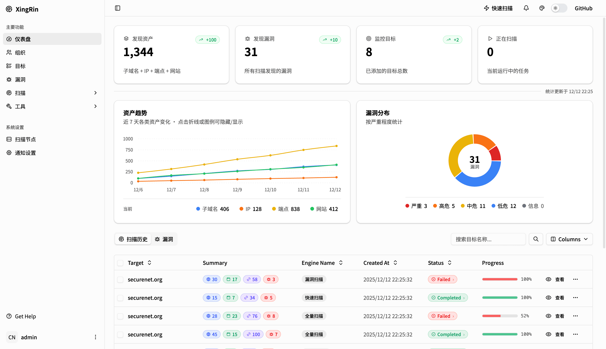
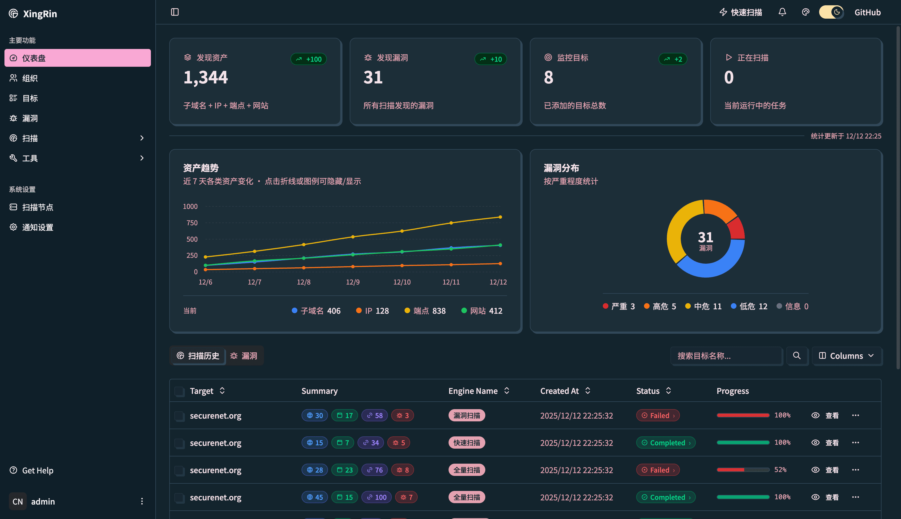
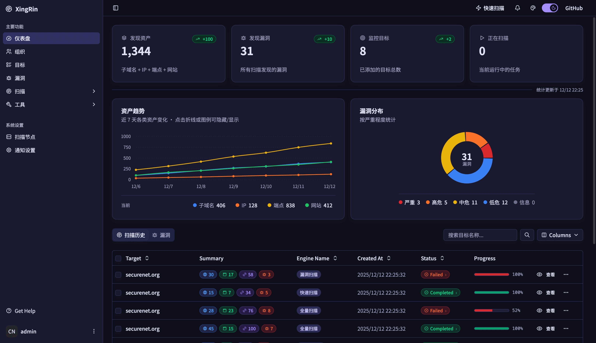
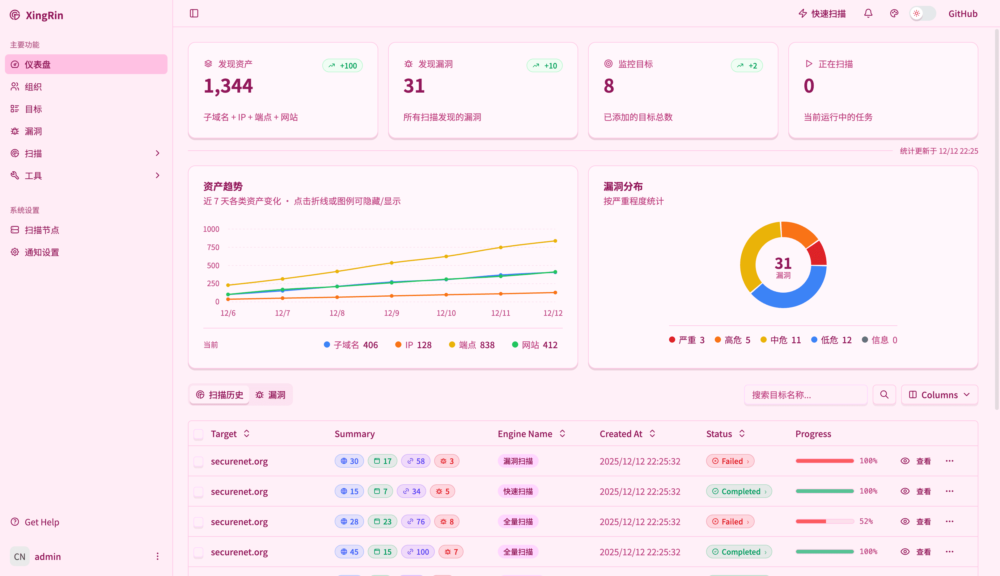
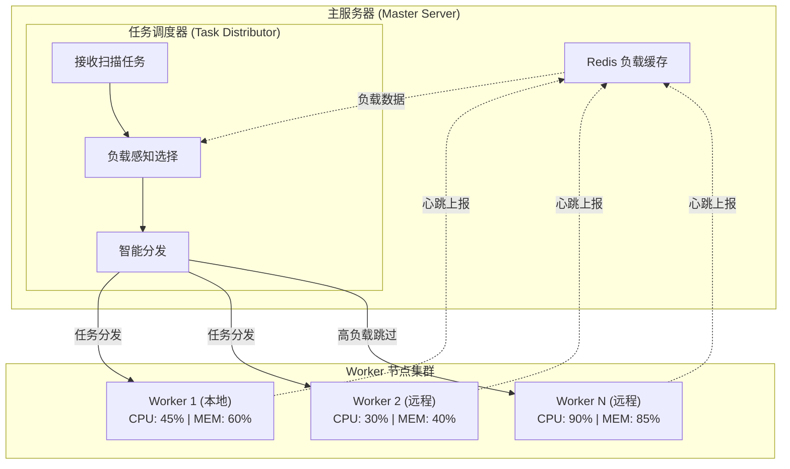

<h1 align="center">XingRin - 星环</h1>

<p align="center">
  <b>开源攻击面管理平台 (ASM) | 面向授权安全测试与防御研究的资产发现与安全自动化系统</b>
</p>

<p align="center">
  <b>持续维护中</b>：由于现在架构，代码对于ai开发来说，演化进度难度很高，代码原生分布式能力弱，为了适应项目的长期发展，正在进行新一代架构重构，后端采用 Go 语言为核心，其强大的分布式能力是目前最优解，当前版本暂停维护，Issue、建议和 PR 都欢迎提交，旧项目的所有建议，都会逐步迁移到新版本。目前正在重构编排逻辑以及引擎逻辑，最快八月，区别在于可实现自定义工具引擎加入，自定义扫描流程编排，欢迎入群等待。
  
</p>


<p align="center">
  <a href="https://github.com/yyhuni/xingrin/stargazers"></a>
  <a href="https://github.com/yyhuni/xingrin/network/members"></a>
  <a href="https://github.com/yyhuni/xingrin/issues"></a>
  <a href="https://github.com/yyhuni/xingrin/blob/main/LICENSE"></a>
</p>

<p align="center">
  <a href="#功能特性">功能特性</a> •
  <a href="#全局资产搜索">资产搜索</a> •
  <a href="#快速开始">快速开始</a> •
  <a href="#文档">文档</a> •
  <a href="#反馈与贡献">反馈与贡献</a>
</p>

<p align="center">
  <sub>关键词: Open Source | ASM | 攻击面管理 | 授权安全测试 | 防御研究 | 资产发现 | 资产搜索 | 安全自动化 | 风险检测 | 子域名枚举 | EASM</sub>
</p>

---
## 在线 Demo

 **[https://xingrin.vercel.app/](https://xingrin.vercel.app/)**

> 仅用于 UI 展示，未接入后端数据库

> XingRin 聚焦 **自有资产管理、授权安全测试与防御研究** 场景，帮助安全团队对互联网暴露面进行持续发现、监控与分析。

---

<p align="center">
  <b>现代化 UI</b>
</p>

<p align="center">
  
  
  
  
</p>

## 文档

- [技术文档](./docs/README.md) - 技术文档导航（持续完善中）
- [快速开始](./docs/quick-start.md) - 一键安装和部署指南
- [版本管理](./docs/version-management.md) - Git Tag 驱动的自动化版本管理系统
- [安全检测模板架构](./docs/nuclei-template-architecture.md) - 检测模板仓库的存储与同步
- [字典文件架构](./docs/wordlist-architecture.md) - 字典文件的存储与同步
- [扫描流程架构](./docs/scan-flow-architecture.md) - 完整扫描流程与工具编排
- [贡献指南](./CONTRIBUTING.md) - Issue、Pull Request 与贡献约定
- [安全策略](./SECURITY.md) - 漏洞报告与安全响应流程
- [行为准则](./CODE_OF_CONDUCT.md) - 社区协作行为规范


---

## 功能特性

### 扫描能力

| 功能 | 状态 | 工具 | 说明 |
|------|------|------|------|
| 子域名扫描 | 已完成 | Subfinder, Amass, PureDNS | 被动收集 + 主动枚举，聚合 50+ 数据源 |
| 端口扫描 | 已完成 | Naabu | 自定义端口范围 |
| 站点发现 | 已完成 | HTTPX | HTTP 探测，自动获取标题、状态码、技术栈 |
| 指纹识别 | 已完成 | XingFinger | 2.7W+ 指纹规则，多源指纹库 |
| URL 收集 | 已完成 | Waymore, Katana | 历史数据 + 主动爬取 |
| 目录扫描 | 已完成 | FFUF | 高效探测，智能字典 |
| 安全检测 | 已完成 | Nuclei, Dalfox | 9000+ 检测模板，覆盖常见 Web 风险与配置问题 |
| 站点截图 | 已完成 | Playwright | WebP 高压缩存储 |

### 平台能力

| 功能 | 状态 | 说明 |
|------|------|------|
| 目标管理 | 已完成 | 多层级组织，支持域名/IP 目标 |
| 资产快照 | 已完成 | 扫描结果对比，追踪资产变化 |
| 黑名单过滤 | 已完成 | 全局 + Target 级，支持通配符/CIDR |
| 定时任务 | 已完成 | Cron 表达式，自动化周期扫描 |
| 分布式扫描 | 已完成 | 多 Worker 节点，负载感知调度 |
| 全局搜索 | 已完成 | 表达式语法，多字段组合查询 |
| 通知推送 | 已完成 | 企业微信、Telegram、Discord |
| API 密钥管理 | 已完成 | 可视化配置各数据源 API Key |

### 扫描流程架构

完整的扫描流程包括：子域名发现、端口扫描、站点发现、指纹识别、URL 收集、目录扫描、安全检测等阶段

```mermaid
flowchart LR
    START["开始扫描"]
    
    subgraph STAGE1["阶段 1: 资产发现"]
        direction TB
        SUB["子域名发现<br/>subfinder, amass, puredns"]
        PORT["端口扫描<br/>naabu"]
        SITE["站点识别<br/>httpx"]
        FINGER["指纹识别<br/>xingfinger"]
        SUB --> PORT --> SITE --> FINGER
    end
    
    subgraph STAGE2["阶段 2: 深度分析"]
        direction TB
        URL["URL 收集<br/>waymore, katana"]
        DIR["目录扫描<br/>ffuf"]
        SCREENSHOT["站点截图<br/>playwright"]
    end
    
    subgraph STAGE3["阶段 3: 安全检测"]
        VULN["安全检测<br/>nuclei, dalfox"]
    end
    
    FINISH["扫描完成"]
    
    START --> STAGE1
    FINGER --> STAGE2
    STAGE2 --> STAGE3
    STAGE3 --> FINISH
    
    style START fill:#34495e,stroke:#2c3e50,stroke-width:2px,color:#fff
    style FINISH fill:#27ae60,stroke:#229954,stroke-width:2px,color:#fff
    style STAGE1 fill:#3498db,stroke:#2980b9,stroke-width:2px,color:#fff
    style STAGE2 fill:#9b59b6,stroke:#8e44ad,stroke-width:2px,color:#fff
    style STAGE3 fill:#e67e22,stroke:#d35400,stroke-width:2px,color:#fff
    style SUB fill:#5dade2,stroke:#3498db,stroke-width:1px,color:#fff
    style PORT fill:#5dade2,stroke:#3498db,stroke-width:1px,color:#fff
    style SITE fill:#5dade2,stroke:#3498db,stroke-width:1px,color:#fff
    style FINGER fill:#5dade2,stroke:#3498db,stroke-width:1px,color:#fff
    style URL fill:#bb8fce,stroke:#9b59b6,stroke-width:1px,color:#fff
    style DIR fill:#bb8fce,stroke:#9b59b6,stroke-width:1px,color:#fff
    style SCREENSHOT fill:#bb8fce,stroke:#9b59b6,stroke-width:1px,color:#fff
    style VULN fill:#f0b27a,stroke:#e67e22,stroke-width:1px,color:#fff
```



详细说明请查看 [扫描流程架构文档](./docs/scan-flow-architecture.md)

### 分布式架构
- **多节点扫描** - 支持部署多个 Worker 节点，横向扩展扫描能力
- **本地节点** - 零配置，安装即自动注册本地 Docker Worker
- **远程节点** - SSH 一键部署远程 VPS 作为扫描节点
- **负载感知调度** - 实时感知节点负载，自动分发任务到最优节点
- **节点监控** - 实时心跳检测，CPU/内存/磁盘状态监控
- **断线重连** - 节点离线自动检测，恢复后自动重新接入



### 全局资产搜索
- **多类型搜索** - 支持 Website 和 Endpoint 两种资产类型
- **表达式语法** - 支持 `=`（模糊）、`==`（精确）、`!=`（不等于）操作符
- **逻辑组合** - 支持 `&&` (AND) 和 `||` (OR) 逻辑组合
- **多字段查询** - 支持 host、url、title、tech、status、body、header 字段
- **CSV 导出** - 流式导出全部搜索结果，无数量限制

#### 搜索语法示例

```bash
# 基础搜索
host="api"                    # host 包含 "api"
status=="200"                 # 状态码精确等于 200
tech="nginx"                  # 技术栈包含 nginx

# 组合搜索
host="api" && status=="200"   # host 包含 api 且状态码为 200
tech="vue" || tech="react"    # 技术栈包含 vue 或 react

# 复杂查询
host="admin" && tech="php" && status=="200"
url="/api/v1" && status!="404"
```

### 可视化界面
- **数据统计** - 资产/漏洞统计仪表盘
- **实时通知** - WebSocket 消息推送
- **通知推送** - 实时企业微信，tg，discard消息推送服务

---

## 快速开始

### 环境要求

- **操作系统**: Ubuntu 20.04+ / Debian 11+ 
- **系统架构**: AMD64 (x86_64) / ARM64 (aarch64)
- **硬件**: 2核 4G 内存起步，20GB+ 磁盘空间

### 一键安装

```bash
# 克隆项目
git clone https://github.com/yyhuni/xingrin.git
cd xingrin

# 安装并启动（生产模式）
sudo ./install.sh

# 中国大陆用户推荐使用镜像加速（第三方加速服务可能会失效，不保证长期可用）
sudo ./install.sh --mirror
```

> **--mirror 参数说明**
> - 自动配置 Docker 镜像加速（国内镜像源）
> - 加速 Git 仓库克隆（Nuclei 模板等）

### 访问服务

- **Web 界面**: `https://ip:8083` 
- **默认账号**: admin / admin（首次登录后请修改密码）

### 常用命令

```bash
# 启动服务
sudo ./start.sh

# 停止服务
sudo ./stop.sh

# 重启服务
sudo ./restart.sh

# 卸载
sudo ./uninstall.sh
```

## 反馈与贡献

- **发现 Bug、想法或改进建议**：欢迎提交 [Issue](https://github.com/yyhuni/xingrin/issues)
- **想直接参与开发**：欢迎发起 Pull Request，提交前建议先阅读 [贡献指南](./CONTRIBUTING.md)
- **安全问题反馈**：请优先阅读 [安全策略](./SECURITY.md)，避免公开披露未修复漏洞

## 联系
- 微信公众号: **塔罗安全学苑**
- 微信群去公众号底下的菜单，有个交流群，点击就可以看到了，链接过期可以私信我拉你


### 关注公众号免费领取指纹库

| 指纹库 | 数量 |
|--------|------|
| ehole.json | 21,977 |
| ARL.yaml | 9,264 |
| goby.json | 7,086 |
| FingerprintHub.json | 3,147 |

> 关注公众号回复「指纹」即可获取

## 赞助支持

如果这个项目对你有帮助，谢谢请我能喝杯蜜雪冰城，你的star和赞助是我免费更新的动力

<p>
  
  
</p>


## 安全与合规说明

**重要：请在使用前仔细阅读**

1. 本项目面向**授权安全测试**、**防御研究**与**自有资产攻击面管理**场景
2. 使用者必须确保已获得目标系统、数据和环境的**明确合法授权**
3. 请勿将本项目用于任何未经授权的扫描、入侵、破坏或其他违法行为
4. 使用者应自行确认其行为符合所在地区法律法规、合同义务和组织政策
5. 项目维护者**不对滥用行为负责**

使用本工具即表示您同意：
- 仅在合法授权范围内使用
- 遵守所在地区的法律法规
- 承担因滥用产生的一切后果

## Star History

如果这个项目对你有帮助，请给一个 Star 支持一下！

[](https://star-history.com/#yyhuni/xingrin&Date)

## 许可证

本项目采用 [MIT License](LICENSE)。

MIT 许可证允许商业和非商业使用、修改、分发与私有部署，但要求保留原始版权和许可证声明。

请注意：开源许可证授予的是代码使用、修改和分发权限，并不构成对任何未经授权安全测试或违法行为的许可。使用者仍需自行确保其用途合法、合规且已获得明确授权。
